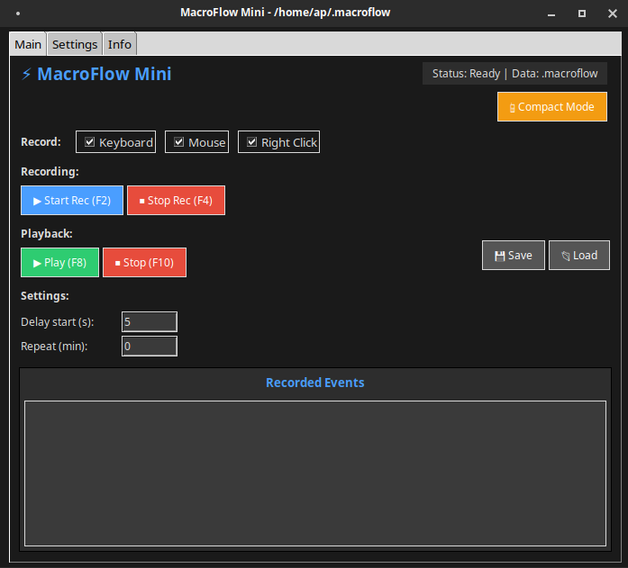

# MacroFlow Mini 🚀

**MacroFlow Mini** is an advanced mouse and keyboard automation tool that allows you to record and replay user actions. Perfect for automating repetitive tasks!


## 📷 Screenshot



## ✨ Features

### 🎯 Recording
- **Mouse recording** - Left/Right/Middle button clicks and drags
- **Keyboard recording** - All key presses and releases
- **Template matching** - Smart icon/image recognition for accurate playback
- **Delay capture** - Records natural timing between actions

### ▶️ Playback
- **Exact replay** - Replays actions with original timing
- **Template-based** - Uses image recognition for reliable playback
- **Looping** - Set repeat intervals for continuous automation
- **Delay start** - Countdown before playback begins

### 🎨 Interface
- **Dark theme** - Modern dark UI with accent colors
- **Compact mode** - Floating mini-window for quick access
- **System tray** - Run in background with tray icon
- **Tabbed interface** - Organized settings and info tabs

### ⚙️ Advanced
- **Hotkey support** - Customizable keyboard shortcuts (F2, F4, F8, F10)
- **Template library** - Save and reuse screen regions for matching
- **Multi-monitor support** - Works across all displays
- **Portable** - Standalone executables available

## 📦 Installation

### Option 1: Python Script
```bash
# Clone repository
git clone https://github.com/pleomati/macroflow.git
cd macroflow
```
# Install dependencies
```bash
pip install -r requirements.txt
```
# Run the script
```bash
python MacroFlow.py
```
### Option 2: Standalone Executable (Recommended)
Download the latest release for your system:

| Platform | File | Size |
|----------|------|------|
| **Windows** | `MacroFlow.exe` | ~50MB |
| **Linux** | `MacroFlow.AppImage` | ~75MB |
| **macOS** | `MacroFlow.dmg` | Coming soon |

### Compilation with nuitka
```bash
pip install nuitka
python3 -m nuitka --standalone --onefile --windows-disable-console --include-data-files=icon.ico=icon.ico --windows-icon-from-ico=icon.ico --include-package-data=PIL --enable-plugin=tk-inter --windows-console-mode=disable --follow-imports --include-module=keyboard --include-module=pynput.keyboard --include-module=pynput.mouse --include-module=pynput --include-module=cv2 --include-module=numpy --include-module=pystray --output-dir=build MacroFlow.py
```
